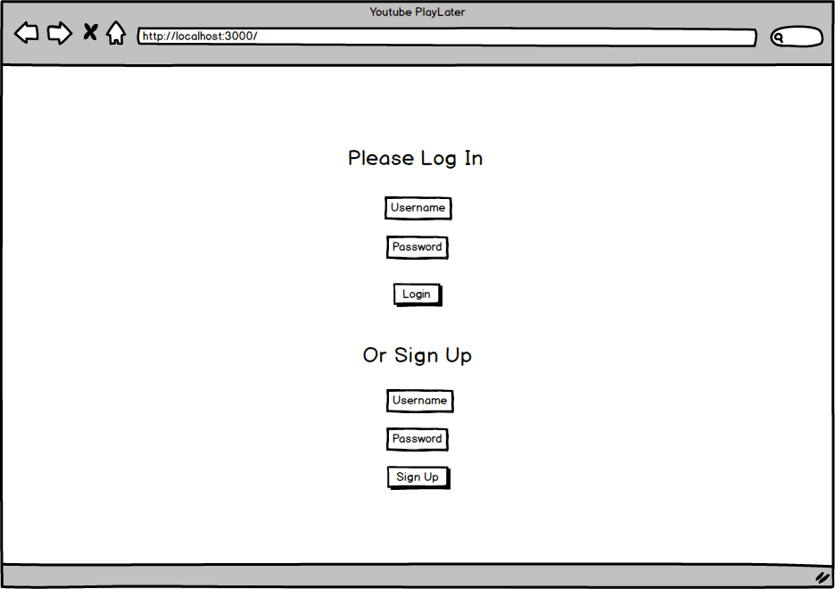
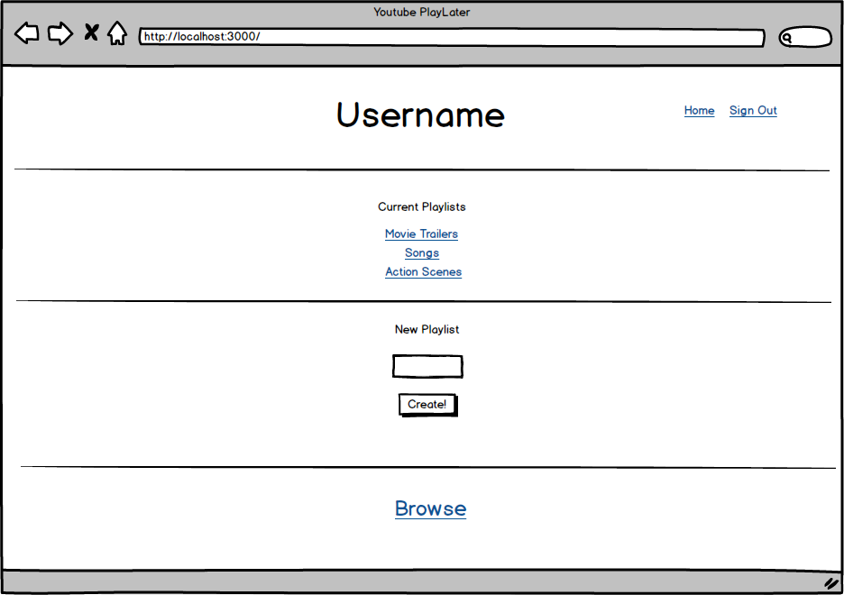
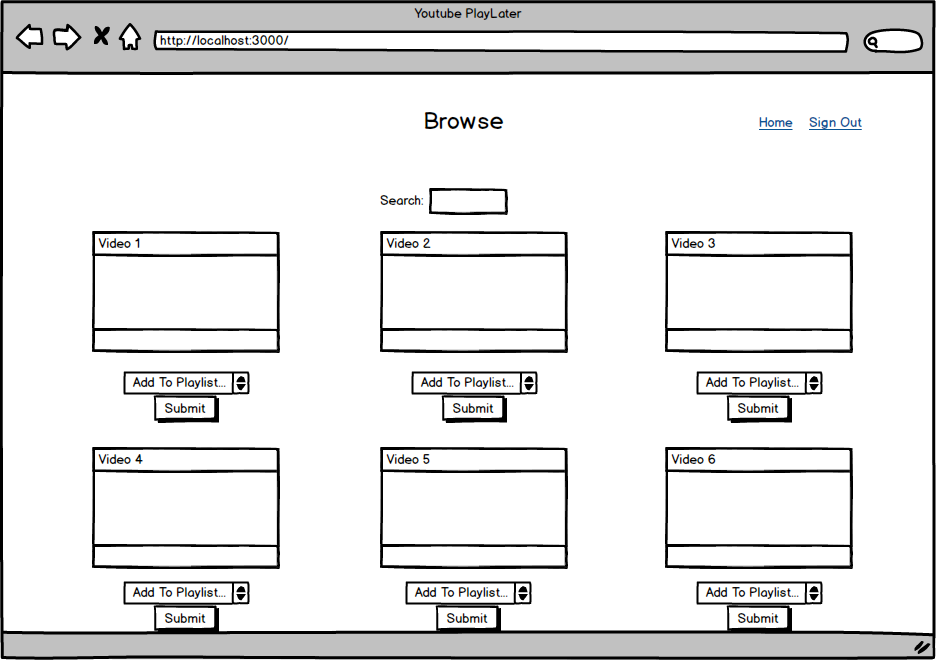
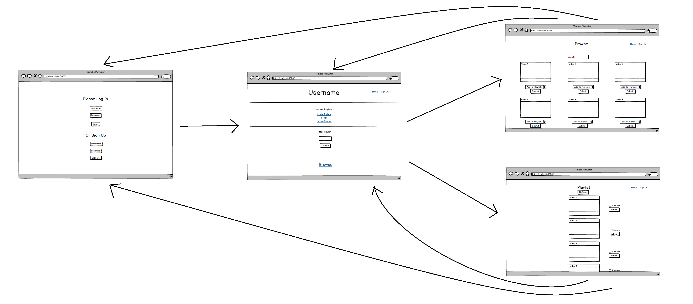

# Youtube PlayLater 

## Overview

This project aims to mimic youtube's playlist. It will allow you to log in and generate playlists based on youtube videos you choose to add to playlists. 

You can either create a new playlist, delete from a playlist or browse for videos that you wish to add to a playlist. We allow login and sign ups accordingly for user authentication and to remember playlists. 

## Data Model

User {
  username: "jevons",
  hash: // a password hash,
  playlists: // an array of playlist objects
}

Playlist objects {
  videos: //array of video objects
}
  
Video objects {
  title: "funny pug videos",
  link: "https://www.youtube.com/watch?v=PyxoUq6LzJc"
}

## [Link to Commented First Draft Schema](db.js) 

[db.js](https://github.com/nyu-csci-ua-0480-007-fall-2017/jw4106-final-project/blob/master/db.js)

## Wireframes

/ - page for Login

/home - page for creating/browsing playlists

/Browse - page for new videos

/playlist?playlist=name - page showing a playlist

## Site map

## User Stories or Use Cases

(___TODO__: write out how your application will be used through [user stories](http://en.wikipedia.org/wiki/User_story#Format) and / or [use cases](https://www.mongodb.com/download-center?jmp=docs&_ga=1.47552679.1838903181.1489282706#previous)_)

1. as non-registered user, I can register a new account with the site
2. as a user, I can log in to the site
3. as a user, I can create a playlist list
4. as a user, I can view all of the playlists I've created in a single list
5. as a user, I can add/remove videos to an existing playlist
6. as a user, I can browse for videos to add

## Research Topics

(___TODO__: the research topics that you're planning on working on along with their point values... and the total points of research topics listed_)

* (5 points) Integrate user authentication
    * I'm going to be using a login for user authentication
    * And account has been made for testing; I'll email you the password
* (4 points) Perform client side form validation using a JavaScript library
    * see <code>cs.nyu.edu/~jversoza/ait-final/my-form</code>
    * if you put in a number that's greater than 5, an error message will appear in the dom

## [Link to Initial Main Project File](app.js) 

[app.js](https://github.com/nyu-csci-ua-0480-007-fall-2017/jw4106-final-project/blob/master/app.js)

## Annotations / References Used

1. [passport.js authentication docs](http://passportjs.org/docs) - (add link to source code that was based on this)
2. [Youtube API tutorial](https://www.youtube.com/watch?v=-vH2eZAM30s)
3. Not many tutorials yet...